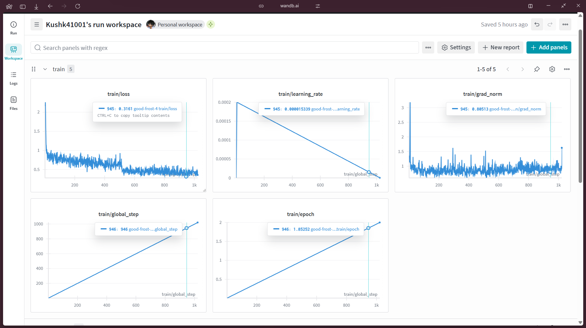

# Fine-Tuning Llama-3 8B for Indian Constitutional Law Q&A

This project demonstrates the end-to-end process of fine-tuning the Meta Llama-3 8B model on a custom dataset of question-answer pairs related to the Constitution of India. The goal was to create a specialized model capable of acting as an expert legal assistant for this domain, running efficiently on consumer-grade hardware.

### Key Features & Technologies
-   **Model**: Meta Llama-3 8B
-   **Technique**: Parameter-Efficient Fine-Tuning (PEFT) using QLoRA.
-   **Library**: [Unsloth](https://github.com/unslothai/unsloth) for 2x faster, memory-efficient training.
-   **Frameworks**: PyTorch, Hugging Face `transformers`, `datasets`, and `trl`.
-   **Dataset**: Custom-built JSON file (`constitution_qa.json`) with Q&A pairs on the Indian Constitution.
-   **Tracking**: Experiment metrics logged with Weights & Biases.

---

### Project Workflow

1.  **Environment Setup**: Installed `unsloth` and dependencies, with specific libraries chosen based on the GPU's Compute Capability to maximize performance.

2.  **Data Preparation**: A custom JSON dataset was loaded and formatted using a specialized prompt template. This template primes the model to act as a constitutional law expert, ensuring the generated answers are in the correct tone and context.

    ```python
    expert_constitution_prompt = """You are an expert on the Constitution of India. Your task is to answer the following question directly and accurately based on constitutional principles.

    ### Question:
    {}

    ### Answer:
    {}"""
    ```

3.  **Efficient Fine-Tuning**: The Llama-3 8B model was loaded in 4-bit precision (QLoRA) to drastically reduce memory usage. The Unsloth library was leveraged to achieve significant speedups in the training loop. LoRA adapters were attached to the model's attention and feed-forward layers, meaning only **0.52%** of the total parameters were trained.

4.  **Training**: The model was trained for 60 steps on a single Google Colab GPU. The training process and all metrics were monitored using an integration with Weights & Biases.

5.  **Inference & Saving**: After training, the final LoRA adapters were saved and merged to create standalone models in multiple formats (`4-bit`, `16-bit`, and `GGUF`) for versatile deployment, including CPU-based inference with `llama.cpp`.

---

### Results and Evaluation

The fine-tuning process was successful, as indicated by the training metrics. The model quickly learned to answer questions based on the provided constitutional data.



* **Training Loss (`train/loss`)**: The primary metric for learning. The loss showed a clear and steady downward trend, starting at **~2.2** and converging to an average of **~0.3** by the end of the 1022 steps. This demonstrates that the model was successfully learning the patterns in the custom dataset.
* **Learning Rate (`train/learning_rate`)**: The graph shows the `linear` learning rate scheduler in action. It began with a warm-up phase for the first 5 steps, reaching the peak rate of `2e-4`, followed by a linear decay for the remainder of the training.
* **Gradient Norm (`train/grad_norm`)**: This metric is used to monitor training stability. The gradient norm remained low and stable throughout the process, indicating that there were no "exploding gradients" and the training was smooth.

---

### How to Use

The fine-tuned model adapters can be loaded on top of the base Llama-3 8B model. For inference, provide a prompt formatted according to the template used during training.

**Example Inference Code:**
```python
# Assuming 'model' and 'tokenizer' are loaded
from transformers import TextStreamer

FastLanguageModel.for_inference(model)
text_streamer = TextStreamer(tokenizer)

inputs = tokenizer(
[
    expert_constitution_prompt.format(
        "Who has the power to grant pardons, reprieves, or remissions of punishment?",
        "", # Leave blank for generation
    )
], return_tensors = "pt").to("cuda")

_ = model.generate(**inputs, streamer = text_streamer, max_new_tokens = 128)
```

### Future Work
-   Deploy the model as an interactive web application using Gradio or Streamlit on Hugging Face Spaces.
-   Expand the dataset with more articles and complex legal scenarios from the Constitution.
-   Implement a rigorous evaluation framework using a held-out test set to quantify the model's accuracy and compare its performance against the base Llama-3 model.
